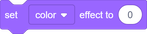
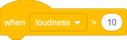
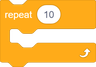
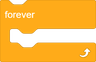
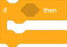
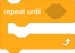

# `ScratchGen`

A Python interface for creating Scratch projects.

## Usage

Use a wildcard import, like so:

```python
from ScratchGen import *
```

The namespace has been curated to avoid pollution.

# Setting up a Project

Initializing a new project takes only one line:

```python
project = Project()
```

## Creating Sprites

To add a sprite to your project, you must specify the sprite's name:

```python
sprite = project.createSprite("Sprite 1")
```

You may create as many sprites as are necessary.

## Adding Costumes and Backdrops

To add a costume to a sprite, provide a filepath and an optional alternative name:

```python
# Costume will be named "scratch cat"
cat_costume = sprite.addCostume("assets/scratch cat.png")

# Costume will be named "balloon"
balloon_costume = sprite.addCostume("balloon", "inflatable.jpg")
```

To add a backdrop to the stage, call `addBackdrop` on the project or on the stage directly.

## Adding Sounds

Call `addSound` in the same place you would call `addCostume` or `addBackdrop` to add sounds.

## Creating Variables and Lists

To create a local variable or list, call these functions from a sprite object:

```python
my_variable = sprite.createVariable("my variable")
my_list = sprite.createList("my list")
```

To make global ones instead, call these functions from the project object (or the stage):

```python
stage = project.stage

global_variable = project.createGlobalVariable("global variable")
global_list = stage.createList("global list")
```

## Creating Scripts

Any sprite or the stage can have as many scripts as necessary. To create one, call `createScript` with the desired sequence of blocks as parameters.

# Blocks

## Motion Category

###  - `MoveSteps`

| Parameter | Description            |
| --------- | ---------------------- |
| `steps`   | How many steps to move |

###  - `GoToPosition`

| Parameter | Description |
| --------- | ----------- |
| `x`       | X position  |
| `y`       | Y position  |

###  - `GoTo`

| Parameter | Description      |
| --------- | ---------------- |
| `target`  | Target to go to  |

Possible values for `target`:
 - `RANDOM`
 - `MOUSE`
 - Any other sprite object

###  - `TurnRight`

| Parameter | Description                         |
| --------- | ----------------------------------- |
| `degrees` | Amount of degrees to turn clockwise |

###  - `TurnLeft`

| Parameter | Description                                |
| --------- | ------------------------------------------ |
| `degrees` | Amount of degrees to turn counterclockwise |

###  - `PointInDirection`

| Parameter   | Description                  |
| ----------- | ---------------------------- |
| `direction` | Amount of degrees to turn to |

###  - `PointTowards`

| Parameter   | Description                |
| ----------- | -------------------------- |
| `target`    | The target to turn towards |

Possible values for `target`:
 - `RANDOM`
 - `MOUSE`
 - Any other sprite object

###  - `GlideToPosition`

| Parameter | Description |
| --------- | ----------- |
| `seconds` | Seconds     |
| `x`       | X position  |
| `y`       | Y position  |

###  - `GlideTo`

| Parameter   | Description                |
| ----------- | -------------------------- |
| `seconds`   | Seconds                    |
| `target`    | The target to turn towards |

Possible values for `target`:
 - `RANDOM`
 - `MOUSE`
 - Any other sprite object

###  - `BounceOffEdge`

###  - `SetRotationStyle`

| Parameter   | Description    |
| ----------- | -------------- |
| `style`     | Rotation style |

Possible values for `target`:
 - `LEFT_RIGHT`
 - `DONT_ROTATE`
 - `ALL_AROUND`

###  - `ChangeX`

| Parameter | Description |
| --------- | ----------- |
| `change`  | Change in X |

###  - `SetX`

| Parameter | Description    |
| --------- | -------------- |
| `x`       | New X position |

###  - `ChangeY`

| Parameter | Description |
| --------- | ----------- |
| `change`  | Change in Y |

###  - `SetY`

| Parameter | Description    |
| --------- | -------------- |
| `y`       | New Y position |

###  - `XPosition`

###  - `YPosition`

###  - `Direction`

## Looks Category

###  - `Say`

| Parameter | Description |
| --------- | ----------- |
| `message` | What to say |

###  - `SayForSeconds`

| Parameter | Description |
| --------- | ----------- |
| `message` | What to say |
| `seconds` | Seconds     |

###  - `Think`

| Parameter | Description   |
| --------- | ------------- |
| `message` | What to think |

###  - `ThinkForSeconds`

| Parameter | Description   |
| --------- | ------------- |
| `message` | What to think |
| `seconds` | Seconds       |

###  - `Show`

###  - `Hide`

###  - `SwitchCostume`

| Parameter | Description          |
| --------- | -------------------- |
| `costume` | Costume to switch to |

###  - `SwitchBackdrop`

| Parameter  | Description           |
| ---------- | --------------------- |
| `backdrop` | Backdrop to switch to |

###  - `SwitchBackdropAndWait`

| Parameter  | Description           |
| ---------- | --------------------- |
| `backdrop` | Backdrop to switch to |

###  - `NextCostume`

###  - `NextBackdrop`

###  - `ChangeGraphicEffect`

| Parameter | Description    |
| --------- | -------------- |
| `effect`  | Graphic effect |
| `change`  | Change amount  |

Possible values for `effect`:
 - `COLOR`
 - `FISHEYE`
 - `WHIRL`
 - `PIXELATE`
 - `MOSAIC`
 - `BRIGHTNESS`
 - `GHOST`

###  - `SetGraphicEffect`

| Parameter | Description    |
| --------- | -------------- |
| `effect`  | Graphic effect |
| `value`   | Effect value   |

Possible values for `effect`:
 - `COLOR`
 - `FISHEYE`
 - `WHIRL`
 - `PIXELATE`
 - `MOSAIC`
 - `BRIGHTNESS`
 - `GHOST`

###  - `ClearGraphicEffects`

###  - `ChangeSize`

| Parameter | Description        |
| --------- | ------------------ |
| `change`  | Size change amount |

###  - `SetSize`

| Parameter | Description |
| --------- | ----------- |
| `size`    | New size    |

###  - `SetLayer`

| Parameter | Description         |
| --------- | ------------------- |
| `layer`   | Layer to be sent to |

Possible values for `layer`:
 - `FRONT`
 - `BACK`

###  - `ChangeLayer`

| Parameter   | Description                      |
| ----------- | -------------------------------- |
| `direction` | What layer direction to go in    |
| `change`    | Amount of layers to move through |

Possible values for `direction`:
 - `FORWARD`
 - `BACKWARD`

###  - `Size`

###  - `Costume`

| Parameter | Description       |
| --------- | ----------------- |
| `option`  | Costume attribute |

Possible values for `option`:
 - `NUMBER`
 - `NAME`

###  - `Backdrop`

| Parameter | Description        |
| --------- | ------------------ |
| `option`  | Backdrop attribute |

Possible values for `option`:
 - `NUMBER`
 - `NAME`

## Sound Category

###  - `Play`

| Parameter | Description   |
| --------- | ------------- |
| `sound`   | Sound to play |

###  - `PlayUntilDone`

| Parameter | Description   |
| --------- | ------------- |
| `sound`   | Sound to play |

###  - `StopSounds`

###  - `SetSoundEffect`

| Parameter | Description  |
| --------- | ------------ |
| `effect`  | Sound effect |
| `value`   | Effect value |

Possible values for `effect`:
 - `PITCH`
 - `PAN`

###  - `ChangeSoundEffect`

| Parameter | Description   |
| --------- | ------------- |
| `effect`  | Sound effect  |
| `change`  | Change amount |

Possible values for `effect`:
 - `PITCH`
 - `PAN`

###  - `ClearSoundEffects`

###  - `SetVolume`

| Parameter | Description |
| --------- | ----------- |
| `volume`  | New volume  |

###  - `ChangeVolume`

| Parameter | Description      |
| --------- | ---------------- |
| `change`  | Change in volume |

###  - `Volume`

## Events Category

###  - `WhenFlagClicked`

###  - `WhenKeyPressed`

| Parameter | Description   |
| --------- | ------------- |
| `key`     | Key to detect |

Possible values for `key`:
 - Any character in U+0021 to U+007E
 - `SPACE`
 - `ENTER`
 - `UP_ARROW`
 - `DOWN_ARROW`
 - `LEFT_ARROW`
 - `RIGHT_ARROW`

###  - `WhenThisSpriteClicked`

###  - `WhenBackdropSwitchesTo`

| Parameter  | Description        |
| ---------- | ------------------ |
| `backdrop` | Backdrop to detect |

###  - `WhenGreaterThan`

| Parameter   | Description           |
| ----------- | --------------------- |
| `value`     | Value to detect       |
| `threshold` | Maximum allowed value |

###  - `WhenBroadcastReceived`

| Parameter   | Description         |
| ----------- | ------------------- |
| `broadcast` | Broadcast to detect |

###  - `Broadcast`

| Parameter   | Description       |
| ----------- | ----------------- |
| `broadcast` | Broadcast to send |

###  - `BroadcastAndWait`

| Parameter   | Description       |
| ----------- | ----------------- |
| `broadcast` | Broadcast to send |

## Control Category

###  - `Wait`

| Parameter  | Description     |
| ---------- | --------------- |
| `duration` | Seconds to wait |

###  - `Repeat`

| Parameter | Description     |
| --------- | --------------- |
| `times`   | Times to repeat |

###  - `Forever`

###  - `If`

| Parameter   | Description        |
| ----------- | ------------------ |
| `condition` | Condition to check |

You may call `.Else(...)` on this block to provide an alternative substack, like so:

```python
If(Equals(1, 1),
    Say("one equals one")
).Else(
    Say("something is terribly wrong")
)
```

###  - `WaitUntil`

| Parameter   | Description        |
| ----------- | ------------------ |
| `condition` | Condition to check |

###  - `RepeatUntil`

| Parameter   | Description        |
| ----------- | ------------------ |
| `condition` | Condition to check |

###  - `Stop`

| Parameter | Description  |
| --------- | ------------ |
| `mode`    | What to stop |

Possible values for `mode`:
 - `ALL`
 - `OTHER_SCRIPTS`
 - `THIS_SCRIPT`

###  - `WhenStartAsClone`

###  - `CreateCloneOf`

| Parameter | Description               |
| --------- | ------------------------- |
| `target`  | What to create a clone of |

Possible values for `target`:
 - `MYSELF`
 - Any other sprite object

###  - `DeleteThisClone`

## Sensing Category

###  - `TouchingObject`

| Parameter | Description    |
| --------- | -------------- |
| `target`  | What to detect |

Possible values for `target`:
 - `MOUSE`
 - `EDGE`
 - Any other sprite object

###  - `TouchingColor`

| Parameter  | Description                     |
| ---------- | ------------------------------- |
| `hex_code` | Hex code of the color to detect |

###  - `ColorTouchingColor`

| Parameter    | Description                   |
| ------------ | ----------------------------- |
| `hex_code_1` | Hex code of the first color   |
| `hex_code_2` | Hex code of the second color  |

###  - `DistanceTo`

| Parameter | Description    |
| --------- | -------------- |
| `target`  | What to detect |

Possible values for `target`:
 - `MOUSE`
 - Any other sprite object

###  - `Timer`

###  - `ResetTimer`

###  - `GetAttribute`

| Parameter   | Description      |
| ----------- | ---------------- |
| `attribute` | Attribute to get |
| `target`    | Target object    |

Possible values for `attribute`:
 - Stage-specific:
    - `BACKDROP_NUMBER`
    - `BACKDROP_NAME`
    - Any global variable
 - Sprite-specific:
    - `X_POSITION`
    - `Y_POSITION`
    - `DIRECTION`
    - `COSTUME_NUMBER`
    - `COSTUME_NAME`
    - `SIZE`
    - Any local variable
 - `VOLUME`

###  - `MouseX`

###  - `MouseY`

###  - `SetDragMode`

| Parameter | Description |
| --------- | ----------- |
| `mode`    | Drag mode   |

Possible values for `mode`:
 - `DRAGGABLE`
 - `NOT_DRAGGABLE`

###  - `MouseDown`

###  - `KeyPressed`

| Parameter | Description   |
| --------- | ------------- |
| `key`     | Key to detect |

Possible values for `key`:
 - Any character in U+0021 to U+007E
 - `SPACE`
 - `ENTER`
 - `UP_ARROW`
 - `DOWN_ARROW`
 - `LEFT_ARROW`
 - `RIGHT_ARROW`

###  - `Current`

| Parameter | Description   |
| --------- | ------------- |
| `option`  | CURRENT WHAT? |

Possible values for `option`:
 - `YEAR`
 - `MONTH`
 - `DATE`
 - `DAY_OF_WEEK`
 - `HOUR`
 - `MINUTE`
 - `SECOND`

###  - `DaysSince2000`

###  - `Loudness`

###  - `Loud`

###  - `AskAndWait`

| Parameter  | Description |
| ---------- | ----------- |
| `question` | What to ask |

###  - `Answer`

###  - `Username`

## Operators Category

###  - `Add`

| Parameter | Description |
| --------- | ----------- |
| `a`       | Operand 1   |
| `b`       | Operand 2   |

###  - `Subtract`

| Parameter | Description |
| --------- | ----------- |
| `a`       | Operand 1   |
| `b`       | Operand 2   |

###  - `Multiply`

| Parameter | Description |
| --------- | ----------- |
| `a`       | Operand 1   |
| `b`       | Operand 2   |

###  - `Divide`

| Parameter | Description |
| --------- | ----------- |
| `a`       | Operand 1   |
| `b`       | Operand 2   |

###  - `LessThan`

| Parameter | Description |
| --------- | ----------- |
| `a`       | Operand 1   |
| `b`       | Operand 2   |

###  - `Equals`

| Parameter | Description |
| --------- | ----------- |
| `a`       | Operand 1   |
| `b`       | Operand 2   |

###  - `GreaterThan`

| Parameter | Description |
| --------- | ----------- |
| `a`       | Operand 1   |
| `b`       | Operand 2   |

###  - `And`

| Parameter | Description |
| --------- | ----------- |
| `a`       | Operand 1   |
| `b`       | Operand 2   |

###  - `Or`

| Parameter | Description |
| --------- | ----------- |
| `a`       | Operand 1   |
| `b`       | Operand 2   |

###  - `Not`

| Parameter   | Description        |
| ----------- | ------------------ |
| `condition` | Condition to check |

###  - `PickRandom`

| Parameter | Description |
| --------- | ----------- |
| `start`   | Minimum     |
| `end`     | Maximum     |

###  - `Join`

| Parameter | Description |
| --------- | ----------- |
| `a`       | Operand 1   |
| `b`       | Operand 2   |

###  - `LetterOf`

| Parameter  | Description     |
| ---------- | --------------- |
| `position` | Index           |
| `string`   | String to index |

###  - `LengthOf`

| Parameter | Description   |
| --------- | ------------- |
| `string`  | Target string |

###  - `Contains`

| Parameter   | Description |
| ----------- | ----------- |
| `string`    | String      |
| `substring` | Substring   |

###  - `Modulo`

| Parameter | Description |
| --------- | ----------- |
| `a`       | Operand 1   |
| `b`       | Operand 2   |

###  - `Round`

| Parameter | Description    |
| --------- | -------------- |
| `value`   | Value to round |

###  - `Operation`

| Parameter   | Description          |
| ----------- | -------------------- |
| `operation` | Operation to perform |
| `value`     | Target value         |

Possible values for `operation`:
 - `ABSOLUTE`
 - `FLOOR`
 - `CEILING`
 - `SQUARE_ROOT`
 - `SINE`
 - `COSINE`
 - `TANGENT`
 - `ARCSINE`
 - `ARCCOSING`
 - `ARCTANGENT`
 - `NATURAL_LOGARITHM`
 - `LOGARITHM`
 - `E_TO_THE`
 - `TEN_TO_THE`

## Variables Category

###  - `SetVariable`

| Parameter  | Description     |
| ---------- | --------------- |
| `variable` | Variable to set |
| `value`    | New value       |

###  - `ChangeVariable`

| Parameter  | Description            |
| ---------- | ---------------------- |
| `variable` | Variable to change     |
| `change`   | Change to the variable |

###  - `HideVariable`

| Parameter  | Description      |
| ---------- | ---------------- |
| `variable` | Variable to hide |

###  - `ShowVariable`

| Parameter  | Description      |
| ---------- | ---------------- |
| `variable` | Variable to show |

###  - `AddToList`

| Parameter | Description    |
| --------- | -------------- |
| `item`    | Item to add    |
| `list`    | List to add to |

###  - `DeleteOfList`

| Parameter | Description         |
| --------- | ------------------- |
| `index`   | Index to delete     |
| `list`    | List to delete from |

###  - `ClearList`

| Parameter | Description   |
| --------- | ------------- |
| `list`    | List to clear |

###  - `InsertIntoList`

| Parameter | Description         |
| --------- | ------------------- |
| `item`    | Item to insert      |
| `index`   | Index to insert at  |
| `list`    | List to insert into |

###  - `ReplaceInList`

| Parameter | Description          |
| --------- | -------------------- |
| `index`   | Index to replace     |
| `list`    | List to replace from |
| `item`    | What to replace with |

###  - `ItemOfList`

| Parameter | Description   |
| --------- | ------------- |
| `index`   | List index    |
| `list`    | List to index |

###  - `ListIndexOf`

| Parameter | Description   |
| --------- | ------------- |
| `item`    | Item to index |
| `list`    | List to index |

###  - `ListLength`

| Parameter | Description     |
| --------- | --------------- |
| `list`    | List to measure |

###  - `ListContains`

| Parameter | Description    |
| --------- | -------------- |
| `list`    | Target list    |
| `item`    | Item to detect |

###  - `HideList`

| Parameter | Description  |
| --------- | ------------ |
| `list`    | List to hide |

###  - `ShowList`

| Parameter | Description  |
| --------- | ------------ |
| `list`    | List to show |

# Custom Blocks

Creating a custom block in the stage/a sprite takes several steps. First, initialize the custom block with a proccode:

```python
prototype = sprite.createCustomBlock("move %s steps in direction %s")
```

Use `%s` for number/text input, and use `%b` for boolean input.

Next, grab the function parameters to be used in its definition:

```python
steps, direction = prototype.getParameters()
```

Finally, give the custom block its definition:

```python
move_in_direction = prototype.setScript(
    PointInDirection(direction),
    MoveSteps(steps)
)
```

Now, you can use the custom block as you would any other block.

```python
sprite.createScript(WhenFlagClicked(),
    GoToPosition(0, 0),
    PointInDirection(90),
    Forever(
        move_in_direction(5, PickRandom(0, 359))
    )
)
```

# Saving

To save your completed project, call the `save` function with a filename of your choice:

```python
project.save("my project.sb3")
```

# Examples

## Custom Block

```python
from ScratchGen import *

project = Project()
sprite = project.createSprite("Custom Block Sprite")

prototype = sprite.createCustomBlock("move %s steps in direction %s")
steps, direction = prototype.getParameters()
move_in_direction = prototype.setScript(
    PointInDirection(direction),
    MoveSteps(steps)
)

sprite.createScript(WhenFlagClicked(),
    GoToPosition(0, 0),
    PointInDirection(90),
    Forever(
        move_in_direction(5, PickRandom(0, 359))
    )
)

project.save("Custom Block Test.sb3")
```

## Text Reversal

```python
from ScratchGen import *

project = Project()

sprite = project.createSprite("Text Reversal Sprite")
sprite.addCostume("assets/scratch logo.png")

reversed_text = project.createGlobalVariable("reversed text")

block = sprite.createCustomBlock("reverse text %s")
text = block.getParameters()
reverse_text = block.setScript(
    SetVariable(reversed_text, ""),

    Repeat(LengthOf(text),
        SetVariable(reversed_text,
            Join(
                LetterOf(
                    Add(LengthOf(reversed_text), 1),
                    text
                ), reversed_text
            )
        )
    )
)

sprite.createScript(WhenFlagClicked(),
    reverse_text("Hello, World!"),
    Say(reversed_text)
)

project.save("Text Reversal Test.sb3")
```

## Jetpack Game

```python
from ScratchGen import *

project = Project()

sprite = project.createSprite("Flying Sprite")
sprite.addCostume("assets/linus jetpack.png")

y_velocity = sprite.createVariable("y velocity")

sprite.createScript(WhenFlagClicked(),
    GoToPosition(0, 0),
    SetVariable(y_velocity, 0),

    Forever(
        If(Or(MouseDown(), KeyPressed(SPACE)),
            ChangeVariable(y_velocity, 2)
        ).Else(
            ChangeVariable(y_velocity, -2)
        ),

        ChangeY(y_velocity)
    )
)

project.save("Flying Test.sb3")
```
